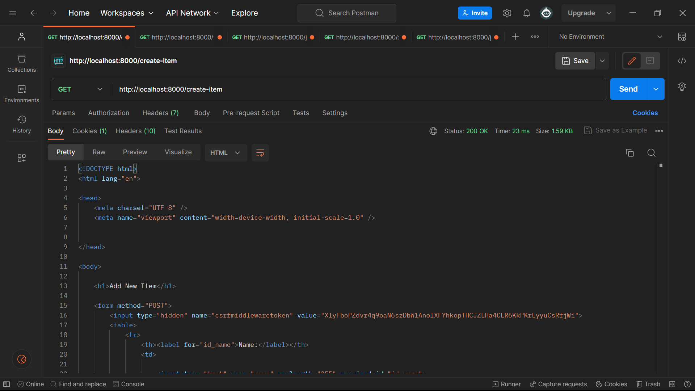
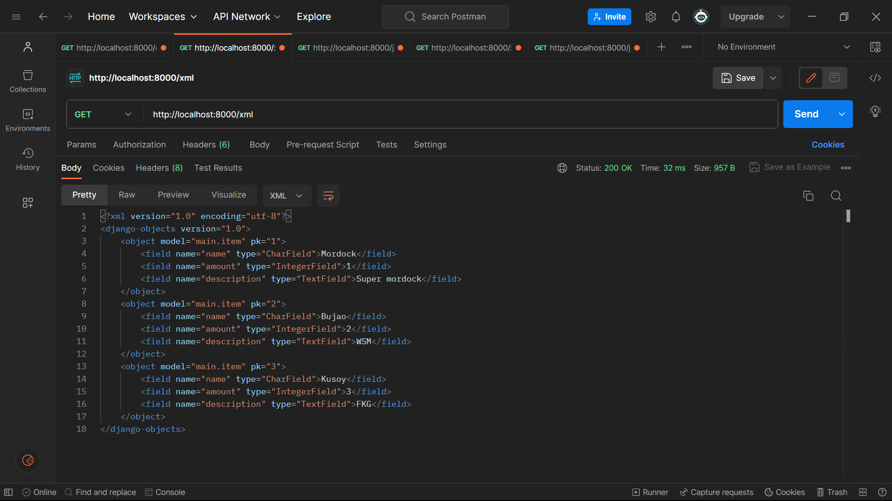
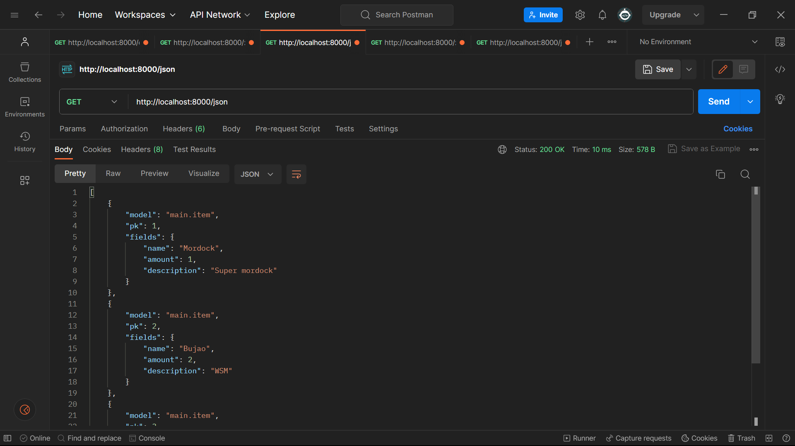
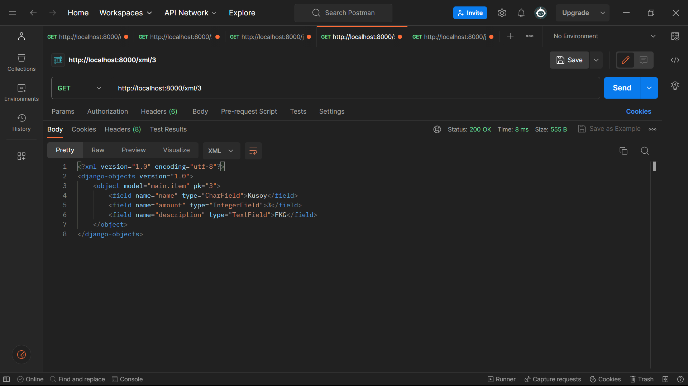
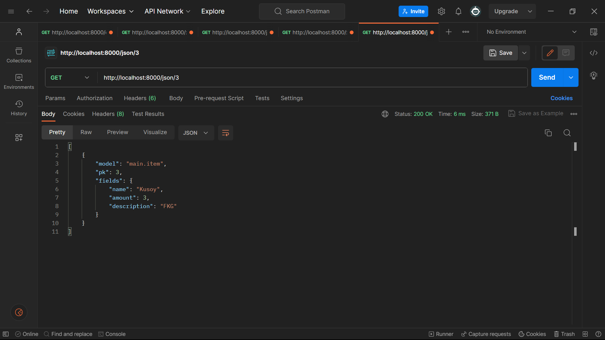

1. **Apa perbedaan antara form POST dan form GET dalam Django?**

    **Jawaban:**

    * **Penggunaan Umum:**
        * **Form POST:** Biasanya digunakan saat mengirimkan data yang perlu disimpan di server, seperti saat mengirimkan formulir pendaftaran atau mengubah data pengguna.
        * **Form GET:** Biasanya digunakan saat mengambil data dari server, seperti saat melakukan pencarian atau mengurutkan data, atau ketika ingin berbagi tautan yang mengandung _parameter query string_.
    * **Keamanan:**
        * **Form POST:** Saat menggunakan metode POST, data yang diisi dalam formulir dikirimkan ke server sebagai bagian dari tubuh permintaan HTTP. Data ini tidak terlihat dalam URL. Ini berarti data yang dikirim dengan POST lebih aman dan tidak terlihat oleh pengguna atau dalam log server.
        * **Form GET:** Saat menggunakan metode GET, data formulir dilekatkan ke URL sebagai _parameter query string_. Ini membuat data terlihat di URL. Ini cocok untuk mengambil data dari server atau ketika Anda ingin berbagi tautan yang berisi parameter. Namun, karena data terlihat di URL, pengguna dapat melihatnya dan data tersebut juga dapat terekspose dalam log server.
    * **Kapasitas Data:**
        * **Form POST:** Cocok untuk mengirimkan data yang lebih besar karena dikirim dalam tubuh permintaan HTTP dan tidak terbatas oleh panjang URL.
        * **Form GET:** Cocok untuk mengirimkan data yang lebih kecil karena panjang URL terbatas oleh batasan web browser dan server.
    * **_Caching_:**
        * **Form POST:** Permintaan POST cenderung tidak disimpan dalam _cache_ oleh _browser_, sehingga tidak menyebabkan masalah _caching_.
        * **Form GET:** Permintaan GET bisa disimpan dalam _cache_ oleh _browser_, yang dapat menyebabkan masalah jika data berubah di server.

         
2. **Apa perbedaan utama antara XML, JSON, dan HTML dalam konteks pengiriman data?**

    **Jawaban:**

    * **Penggunaan Umum:**
        * **XML:** Banyak digunakan untuk pertukaran data antar aplikasi dan konfigurasi, sering digunakan dalam industri seperti _web services_, _RSS feeds_, dan konfigurasi aplikasi.
        * **JSON:** Banyak digunakan dalam pengembangan aplikasi web untuk pertukaran data antara server dan peramban. Hal ini juga digunakan dalam penyimpanan konfigurasi dan pengembangan RESTful APIs.
        * **HTML:** Banyak digunakan untuk membuat halaman web dan menampilkan konten kepada pengguna melalui peramban web.
    * **Sintaksis:**
        * **XML:** Menggunakan _tag_ dengan sintaksis yang ketat untuk mengelompokkan data dan menyusun hierarki. Setiap elemen dibungkus dalam _tag_, seperti &lt;nama>nilai&lt;/nama>.
        * **JSON:** Menggunakan struktur objek dan _array_ yang lebih sederhana dengan menggunakan tanda kurung kurawal {} untuk objek dan tanda kurung siku [] untuk _array_. Data dalam JSON biasanya dalam format "kunci-nilai" seperti "nama": "Nilai".
        * **HTML:** Menggunakan _tag_ untuk mengelompokkan konten dan menentukan struktur halaman web. Tag HTML memiliki sintaksis yang khusus, seperti &lt;tag>konten&lt;/tag>.
    * **Kemampuan:**
        * **XML:** Memiliki fleksibilitas tinggi dalam mendefinisikan struktur data yang kompleks, namun seringkali memiliki _overhead_ sintaksis yang besar.
        * **JSON:** Lebih ringkas dan mudah dibaca oleh manusia dibandingkan XML, tetapi tidak sefleksibel seperti XML dalam mendefinisikan struktur data.
        * **HTML:** Dirancang khusus untuk membuat tampilan halaman web dan memiliki sejumlah _tag_ bawaan yang mendukung struktur konten web.

         
3. **Mengapa JSON sering digunakan dalam pertukaran data antara aplikasi web modern?**

    **Jawaban:**

    JSON sering digunakan dalam pertukaran data antara aplikasi web modern karena memiliki sejumlah keunggulan yang sangat relevan untuk lingkungan pengembangan web saat ini. Pertama-tama, JSON memiliki format yang ringkas dan mudah dibaca oleh manusia, sehingga memudahkan pengembang untuk memahami dan menganalisis data. Selain itu, JSON sangat mendukung struktur data yang bersifat objek dan _array_, yang sangat relevan dalam pengembangan aplikasi web yang menggunakan JavaScript sebagai bahasa pemrograman utama. Dengan format "kunci-nilai" yang sederhana, JSON memungkinkan data untuk diurai dan digunakan dengan mudah dalam kode JavaScript. JSON juga kompatibel dengan banyak bahasa pemrograman lainnya melalui berbagai _library_ dan API, menjadikannya pilihan yang serbaguna untuk pertukaran data antar berbagai komponen dalam ekosistem web modern, termasuk komunikasi antara server dan peramban melalui AJAX atau RESTful APIs. Kesederhanaan, kemudahan penggunaan, dan fleksibilitas JSON menjadikannya pilihan yang kuat dalam memfasilitasi pertukaran data yang efisien dan efektif dalam pengembangan aplikasi web saat ini.

     
4. **Jelaskan bagaimana cara kamu mengimplementasikan checklist di atas secara step-by-step.**

    **Jawaban:**

    1. Membuat input form untuk menambahkan objek model pada app sebelumnya.
        1. Pertama-tama, saya membuat sebuah template dasar yang berfungsi sebagai kerangka umum untuk halaman web dalam proyek ini. Saya menempatkan template ini dalam folder 'templates' pada root folder proyek. Kemudian, saya menyesuaikan konfigurasi pada berkas 'settings.py' dalam subdirektori 'ewod_hearthstone' agar dapat mendeteksi 'base.html' sebagai sebuah template. Kemudian pada subdirektori templates yang ada pada direktori main, saya mengubah kode berkas main.html agar menggunakan base.html sebagai template utama
        2. Selanjutnya, saya membuat formulir sederhana yang akan memungkinkan pengguna untuk menginput data produk yang akan ditampilkan di halaman utama. Untuk ini, saya membuat berkas baru bernama 'forms.py' dalam direktori 'main' untuk menciptakan struktur form. Di dalam berkas 'forms.py', saya mendefinisikan model yang digunakan oleh form, yaitu 'Item'. Ketika pengguna mengisi form dan mengirimkannya, data yang diinput akan disimpan sebagai objek 'Item'. Saya juga menentukan field-field dari model 'Item' yang akan digunakan dalam form, yaitu "name", "amount", dan "description".
        3. Kemudian, saya menambahkan beberapa impor yang diperlukan pada berkas 'views.py' dalam direktori 'main'. Selanjutnya, saya membuat fungsi baru yang dinamai 'create_item' dalam berkas tersebut. Fungsi ini menerima parameter 'request' dan mengandung kode yang akan menghasilkan formulir untuk menambahkan data produk secara otomatis ketika data dari form di-submit. Dalam fungsi 'create_item', saya menggunakan 'ItemForm' untuk membuat objek formulir yang didasarkan pada data yang diterima dari 'request.POST'. Selanjutnya, saya memvalidasi isi input dari formulir tersebut menggunakan 'form.is_valid()', dan jika valid, saya menyimpan data dari formulir tersebut ke dalam database menggunakan 'form.save()'. Terakhir, saya melakukan redirect ke halaman utama menggunakan 'HttpResponseRedirect(reverse('main:show_main'))' setelah data formulir berhasil disimpan.
        4. Selanjutnya, saya mengubah fungsi 'show_main' yang sudah ada pada berkas 'views.py' dengan menambahkan 'items': items pada dictionary konteks. Untuk mengambil seluruh objek 'Item' yang telah tersimpan dalam database, saya menggunakan 'items = Item.objects.all()'.
        5. Saya membuat berkas HTML baru bernama 'create_item.html' dalam direktori 'main/templates'. Di dalam berkas ini, saya menggunakan kode berikut:
            * &lt;form method="POST">: Ini digunakan untuk menentukan blok form dengan metode POST.
            * : Ini adalah token keamanan yang di-generate secara otomatis oleh Django untuk mencegah serangan berbahaya.
            * {{ form.as_table }}: Ini digunakan untuk menampilkan field-field form yang telah didefinisikan dalam 'forms.py' sebagai tabel.
            * &lt;input type="submit" value="Add Item"/>: Ini adalah tombol submit yang akan mengirimkan permintaan ke view 'create_item(request)'.

        6. Terakhir, saya kembali ke halaman 'main.html' dan menambahkan kode di dalam blok  untuk menampilkan data produk dalam bentuk tabel serta tombol "Add New Item" yang akan mengarahkan pengguna ke halaman formulir.  
    2. Tambahkan 5 fungsi views untuk melihat objek yang sudah ditambahkan dalam format HTML, XML, JSON, XML by ID, dan JSON by ID.
        1. Pertama-tama, saya membuka berkas views.py dalam direktori 'main'. Di dalamnya, saya menambahkan import untuk HttpResponse dan Serializer.
        2. Kemudian, saya membuat fungsi baru bernama show_xml yang menerima parameter request. Dalam fungsi show_xml, saya membuat sebuah variabel yang akan menyimpan hasil query dari seluruh data yang ada pada model Item. Kemudian, saya mengembalikan sebuah respons HttpResponse dengan parameter data yang berisi hasil query yang telah diserialisasi menjadi format XML, serta menentukan content_type sebagai "application/xml" untuk mengindikasikan bahwa data yang dikirimkan adalah dalam bentuk XML.
        3. Selanjutnya, saya membuat fungsi baru yang dinamai show_json. Fungsi ini juga menerima parameter request. Di dalamnya, saya melakukan hal yang serupa dengan show_xml, yaitu menghasilkan hasil query dari seluruh data yang ada pada model Item. Kemudian, saya mengembalikan respons HttpResponse dengan parameter data yang berisi hasil query yang telah diserialisasi menjadi format JSON, dan menentukan content_type sebagai "application/json" untuk mengindikasikan bahwa data yang dikirimkan adalah dalam bentuk JSON.
        4. Terakhir, saya membuat dua fungsi baru, show_xml_by_id dan show_json_by_id, yang menerima parameter request dan id. Di dalam kedua fungsi ini, saya melakukan query untuk mengambil data dengan ID tertentu dari model Item. Setelah itu, saya mengembalikan respons HttpResponse dengan parameter data yang berisi hasil query yang telah diserialisasi menjadi format XML atau JSON, tergantung pada fungsi yang dipanggil, dan menentukan content_type sesuai dengan format yang diinginkan, "application/xml" untuk XML atau "application/json" untuk JSON.  
        
    3. Membuat routing URL untuk masing-masing views yang telah ditambahkan pada poin 2.
        1. Pertama-tama, saya membuka berkas urls.py dalam direktori 'main'. Di dalamnya, saya melakukan impor fungsi-fungsi yang telah saya buat sebelumnya di views.py. Kemudian, saya menambahkan beberapa path URL ke dalam urlpatterns. Inilah setiap path URL yang saya tambahkan:
            * path('create-item', create_item, name='create_item'),
            * path('xml/', show_xml, name='show_xml'),
            * path('json/', show_json, name='show_json'),
            * path('xml/&lt;int:id>/', show_xml_by_id, name='show_xml_by_id'),
            * path('json/&lt;int:id>/', show_json_by_id, name='show_json_by_id'), 
  
5. **Screenshot dari hasil akses URL pada Postman.**

    **Gambar:**
    
    
    
    
    